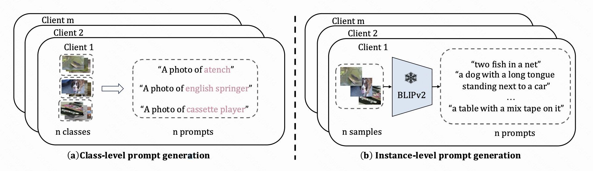
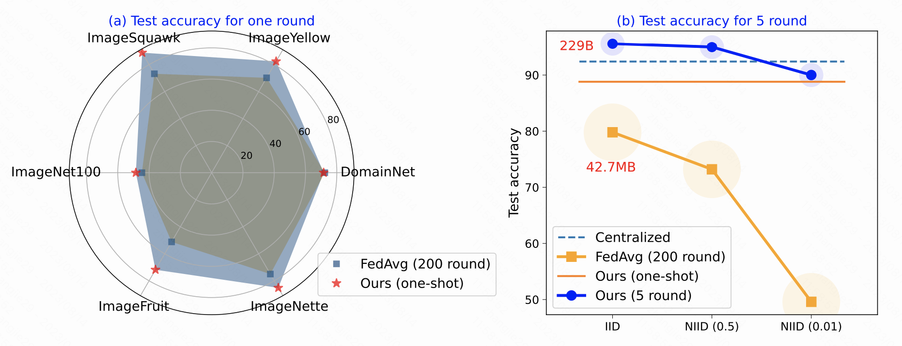
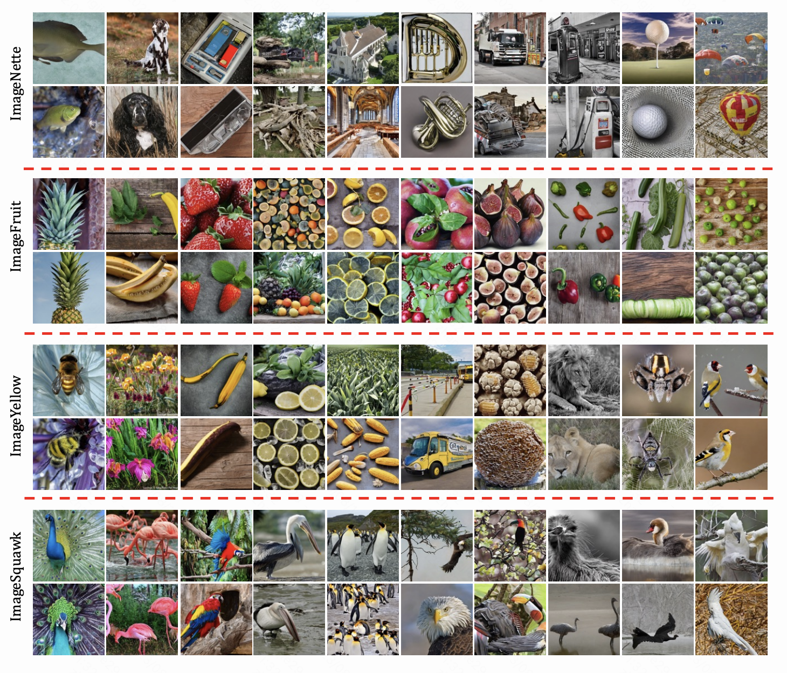

# Abstract 
Existing approaches in Federated Learning (FL) mainly focus on sending model parameters or gradients from clients to a server. However, these methods are plagued by significant inefficiency, privacy, and security concerns. Thanks to the emerging foundation generative models, we propose a novel federated learning framework, namely _Federated Generative Learning_. In this framework, each client can create text embeddings that are tailored to their local data, and send embeddings to the server. Then the informative training data can be synthesized remotely on the server using foundation generative models with these embeddings, which can benefit FL tasks. Our proposed framework offers several advantages, including increased communication efficiency, robustness to data heterogeneity, substantial performance improvements, and enhanced privacy protection. We validate these benefits through extensive experiments conducted on 12 datasets. For example, on the ImageNet100 dataset with a highly skewed data distribution, our method outperforms FedAvg by 12% in a single communication round, compared to FedAvg's performance over 200 communication rounds. We have released the code for all experiments conducted in this study.

# Datasets

In order to adequately simulate scenarios of label distribution skew and feature distribution skew, extensive experiments were conducted on subsets of `ImageNet` and `DomainNet` datasets. The specific construction methods and descriptions of the subsets are presented as follows (for more details, please refer to `helpers/dataset.py`).

| Dataset | Description| #Class | Class name | Class id |
| --- | --- | --- | --- | --- |
| ImageNette | 10 classes from ImageNet1k | 10 | ("tench", "English springer", "cassette player", "chain saw", "church", "French horn", "garbage truck", "gas pump", "golf ball", "parachute") | [0, 217, 482, 491, 497, 566, 569, 571, 574, 701] |
| ImageFruit | 10 classes from ImageNet1k | 10 | ("pineapple", "banana", "strawberry", "orange", "lemon", "pomegranate", "fig", "bell_pepper", "cucumber", "green_apple") | [953, 954, 949, 950, 951, 957, 952, 945, 943, 948] |
| ImageYellow | 10 classes from ImageNet1k | 10 | ("bee", "ladys slipper", "banana", "lemon", "corn", "school_bus", "honeycomb", "lion", "garden_spider", "goldfinch") | [309, 986, 954, 951, 987, 779, 599, 291, 72, 11] |
| ImageSquawk | 10 classes from ImageNet1k | 10 | ("peacock", "flamingo", "macaw", "pelican", "king_penguin", "bald_eagle", "toucan", "ostrich", "black_swan", "cockatoo") | [84, 130, 88, 144, 145, 22, 96, 9, 100, 89] |
| ImageNet-100 | 100 classes from ImageNet1k | 100 | -- | -- |


# Requirements
- You can set up the environment using the command below.
```
conda env create -f environment.yaml
conda activate fgl
```

# Reproducing

## For Our Method
### Data Generation at Server
We investigate two types of prompt generation strategies: `class-level prompt` and `instance-level prompt`. The class-level prompts are generated based on the class names, providing high-level guidance to the generative model.  The instance-level prompt strategy leverages prompts that are tailored for individual instances in the private dataset, which are more informative for training models.

For class-level prompt, run the following command:
```bash
sh scripts/data_generation/class_level.sh $dataset $exp_name $gpu_id
```

For instance-level prompt, run the following command:
```bash
sh scripts/data_generation/instance_level.sh  $raw_data_dir $syn_data_dir $save_prompt_dir $gpu_id
```

### One-Shot FL
Run the following command:
```bash
sh ./scripts/one-shot/fgl.sh  $net $dataset $exp_name $syn $blip $data_path_train $data_path_test $gpu_id

# net:choices ['holocron_resnet18', 'holocron_resnet34', 'holocron_resnet50']
# dataset:choices ["imagenet100", "imagenette", "imagefruit", "imageyellow", "imagesquawk", "domainnet"]
# syn:choices [0, 1]
# blip:choices [0, 1]
```

### 5-round FL
- with finetuning on server
```bash
sh scripts/multi-round/five_round_fgl_sever_finetune.sh $net $dataset $exp_name $data_path_train  $data_path_test $net_path $partition $beta $data_path_server $gpu_id
# net:choices ['holocron_resnet18', 'holocron_resnet34', 'holocron_resnet50']
# dataset:choices ["imagenet100", "imagenette", "imagefruit", "imageyellow", "imagesquawk", "domainnet"]
# partition choices [iid, dirichlet]
# beta:choices [0.5, 1]
```

- without finetuning on server
```bash
sh scripts/multi-round/five_round_fgl.sh $net $dataset $exp_name $data_path_train  $data_path_test $net_path $partition $beta $gpu_id
# net:choices ['holocron_resnet18', 'holocron_resnet34', 'holocron_resnet50']
# dataset:choices ["imagenet100", "imagenette", "imagefruit", "imageyellow", "imagesquawk", "domainnet"]
# partition choices [iid, dirichlet]
# beta:choices [0.5, 1]
```

## For Baseline
- FedAvg. Please run the following command:

```bash
sh scripts/multi-round/fedavg.sh $net $dataset $exp_name  $data_path_train  $data_path_test $partition $beta $gpu_id
# net:choices ['holocron_resnet18', 'holocron_resnet34', 'holocron_resnet50']
# dataset:choices ["imagenet100", "imagenette", "imagefruit", "imageyellow", "imagesquawk", "domainnet"]
# partition choices [iid, dirichlet]
# beta:choices [0.5, 1]
```

- Centralized Training. Please run the following command:
```bash
sh scripts/centralized/central.sh $net $dataset $exp_name $data_path_train  $data_path_test $gpu_id
# net:choices ['holocron_resnet18', 'holocron_resnet34', 'holocron_resnet50']
# dataset:choices ["imagenet100", "imagenette", "imagefruit", "imageyellow", "imagesquawk", "domainnet"]

```
# Examples
Here you can see the final results:


Here are some visualization examples:
- For Imagenet subset:

- For DomainNet:


# Citation
```
@misc{zhang2023federated,
      title={Federated Generative Learning with Foundation Models}, 
      author={Jie Zhang and Xiaohua Qi and Bo Zhao},
      year={2023},
      eprint={2306.16064},
      archivePrefix={arXiv},
      primaryClass={cs.LG}
}
```
